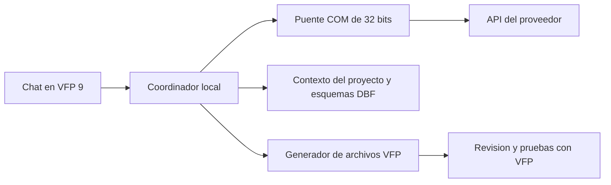

# Arquitectura propuesta

## Implementado

Un punto de entrada PRG abre un formulario modal definido en código. El chat
almacena texto en memoria, presenta respuestas de demostración y permite abrir
dos ventanas: configuración informativa y ejemplo nativo. No hay conexión de red,
persistencia de configuración, lectura de DBF ni generación automática.

## Diseño objetivo

- **Interfaz VFP:** chat, cambios propuestos, configuración, cancelación e historial.
- **Puente:** HTTPS, serialización JSON, streaming, errores, límites y credenciales.
  La elección de tecnología y el contrato COM requieren una prueba de integración.
  Las operaciones de red deberán ser asíncronas para no bloquear el formulario.
- **Proveedores:** adaptadores independientes. Una API de generación y un agente
  como Codex o Cursor no deben tratarse como contratos idénticos.
- **Contexto:** código seleccionado y esquemas de tablas. Los registros reales
  no se envían de forma predeterminada. VFP obtiene la estructura de sus DBF.
- **Generación:** primero PRG; luego plantillas y constructores de SCX/SCT,
  MNX/MNT y FRX/FRT. Un formulario definido en PRG no equivale a un SCX editable.
- **Validación:** compilación local y pruebas sobre datos de ejemplo. Compilar
  no demuestra que la lógica sea correcta. Una sesión privada de datos tampoco
  es un aislamiento de seguridad para ejecutar código arbitrario.

## Límites de responsabilidad

El modelo propone cambios. La aplicación valida las rutas y muestra los cambios
antes de aplicarlos. El código recibido no se ejecuta automáticamente sobre
datos de producción. El usuario debe poder revisar y revertir los cambios.

Las claves se guardarán mediante un mecanismo de Windows, fuera del repositorio.
El JSON de ejemplo contiene referencias a credenciales, nunca los secretos.
Los errores y registros deberán omitir claves y datos sensibles.

El entorno de desarrollo de VFP se necesita para las tareas de desarrollo
y validación; no se presupone que su runtime incluya todas las funciones del IDE.
